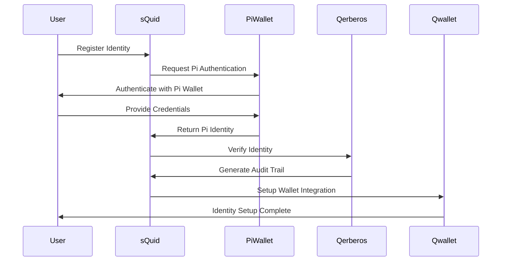
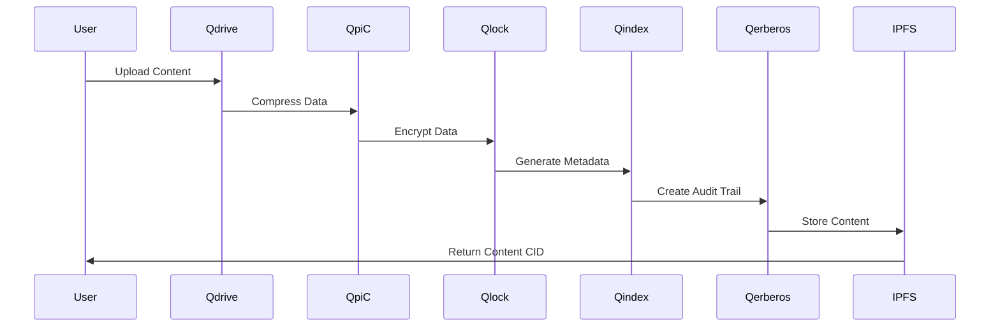
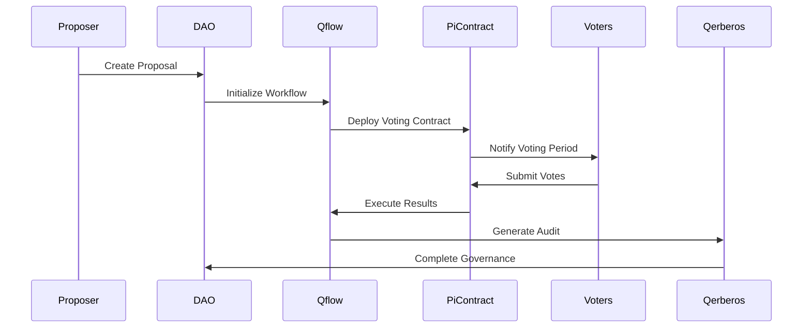
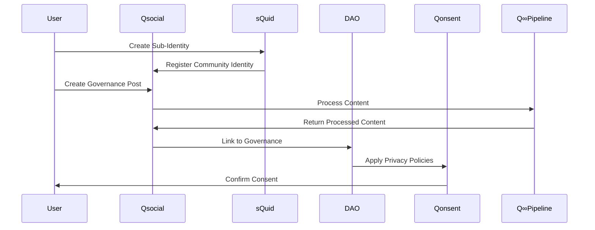

# {{t:title}}

Version: {{version}} | Last Updated: {{lastUpdated}}

## {{t:overview}}

This guide provides detailed workflows for executing and understanding the AnarQ&Q ecosystem demonstration scenarios. Each scenario showcases different aspects of the decentralized ecosystem integration.

## {{t:scenarios}}

The demo platform includes four main scenarios that demonstrate different use cases and integration patterns:

### {{t:identity_flow}}

The identity flow demonstrates user registration, authentication, and identity verification through the integrated sQuid and Pi Network systems.

#### Flow Diagram



#### Execution Steps

1. **User Registration**
   ```bash
   npm run demo:scenario:identity --step=register
   ```

2. **Pi Wallet Authentication**
   ```bash
   npm run demo:scenario:identity --step=pi-auth
   ```

3. **Identity Verification**
   ```bash
   npm run demo:scenario:identity --step=verify
   ```

4. **Wallet Integration**
   ```bash
   npm run demo:scenario:identity --step=wallet
   ```

#### Expected Outcomes

- ✅ sQuid identity created and verified
- ✅ Pi Network identity linked securely
- ✅ Qerberos audit trail generated
- ✅ Qwallet integration configured
- ✅ Complete identity verification within 2 seconds

### {{t:content_flow}}

The content flow demonstrates content creation, processing through the Q∞ pipeline, storage, and retrieval.

#### Flow Diagram



#### Q∞ Data Pipeline

The Q∞ (Q-Infinity) pipeline ensures data integrity and security through the following stages:

1. **Compression (QpiC)**: Advanced compression algorithms reduce data size
2. **Encryption (Qlock)**: User-controlled encryption ensures privacy
3. **Indexing (Qindex)**: Metadata generation for efficient retrieval
4. **Security (Qerberos)**: Audit trail and signature generation
5. **Storage (IPFS)**: Decentralized content-addressed storage

#### Execution Steps

1. **Content Upload**
   ```bash
   npm run demo:scenario:content --step=upload --file=sample.txt
   ```

2. **Pipeline Processing**
   ```bash
   npm run demo:scenario:content --step=process --monitor=true
   ```

3. **Content Retrieval**
   ```bash
   npm run demo:scenario:content --step=retrieve --cid=<content-id>
   ```

4. **Integrity Validation**
   ```bash
   npm run demo:scenario:content --step=validate --cid=<content-id>
   ```

#### Expected Outcomes

- ✅ Content processed through complete Q∞ pipeline
- ✅ Data integrity maintained at each step
- ✅ IPFS storage successful with content CID
- ✅ Retrieval matches original content exactly
- ✅ Processing completed within performance thresholds

### {{t:dao_flow}}

The DAO governance flow demonstrates proposal creation, voting, and execution through integrated modules.

#### Flow Diagram



#### Execution Steps

1. **Proposal Creation**
   ```bash
   npm run demo:scenario:dao --step=propose --title="Ecosystem Upgrade" --description="Upgrade core modules"
   ```

2. **Voting Period**
   ```bash
   npm run demo:scenario:dao --step=vote --proposal-id=<id> --vote=yes
   ```

3. **Result Execution**
   ```bash
   npm run demo:scenario:dao --step=execute --proposal-id=<id>
   ```

4. **Audit Verification**
   ```bash
   npm run demo:scenario:dao --step=audit --proposal-id=<id>
   ```

#### Expected Outcomes

- ✅ Governance proposal created and deployed
- ✅ Pi Network smart contract integration
- ✅ Voting process completed successfully
- ✅ Results executed through Qflow automation
- ✅ Complete audit trail maintained

### {{t:social_flow}}

The social governance flow demonstrates community interaction through Qsocial as a governance hub with sQuid sub-identities and DAO integration.

#### Flow Diagram



#### Execution Steps

1. **Community Registration**
   ```bash
   npm run demo:scenario:social --step=register --community="EcosystemDAO"
   ```

2. **Governance Post Creation**
   ```bash
   npm run demo:scenario:social --step=post --type=governance --content="Proposal discussion"
   ```

3. **Privacy Consent Management**
   ```bash
   npm run demo:scenario:social --step=consent --policy="governance-participation"
   ```

4. **DAO Integration**
   ```bash
   npm run demo:scenario:social --step=dao-link --post-id=<id>
   ```

#### Expected Outcomes

- ✅ Qsocial community governance hub established
- ✅ sQuid sub-identities for moderated participation
- ✅ Content processed through Q∞ pipeline
- ✅ DAO governance integration active
- ✅ Qonsent privacy policies enforced

## {{t:validation}}

### Performance Monitoring

The demo platform continuously monitors performance metrics to ensure system health:

```bash
# Real-time performance monitoring
npm run monitor:performance

# Generate performance report
npm run report:performance --format=json
```

### Validation Gates

Each scenario must pass validation gates before completion:

- **Performance Gate**: Latency ≤ 2s, Throughput ≥ 100 RPS, Error Rate ≤ 1%
- **Decentralization Gate**: Minimum 5 nodes, no single points of failure
- **Integrity Gate**: Complete audit trails, valid Qerberos signatures

### Monitoring Dashboard

Access the real-time monitoring dashboard:

```bash
# Start monitoring dashboard
npm run dashboard:start

# Access at http://localhost:3000/dashboard
```

## {{t:examples}}

### Identity Flow Example

```typescript
import { ScenarioEngine } from './services/ScenarioEngine';
import { IdentityFlowParams } from './interfaces';

const scenarioEngine = new ScenarioEngine();

const identityParams: IdentityFlowParams = {
  userId: 'demo-user-001',
  piWalletId: 'pi-wallet-123',
  enableAuditTrail: true,
  verificationLevel: 'full'
};

const result = await scenarioEngine.executeIdentityFlow(identityParams);
console.log('Identity flow result:', result);
```

### Content Flow Example

```typescript
import { QInfinityDataFlowService } from './services/QInfinityDataFlowService';

const dataFlow = new QInfinityDataFlowService();

const content = "Sample content for Q∞ processing";
const result = await dataFlow.processInput(content, 'demo-user-001');

console.log('Content CID:', result.contentId);
console.log('Audit CID:', result.auditCid);
```

### DAO Governance Example

```typescript
import { PiSmartContractEngine } from './services/PiSmartContractEngine';

const contractEngine = new PiSmartContractEngine();

const proposal = {
  title: "Ecosystem Upgrade Proposal",
  description: "Upgrade core modules to v2.0",
  votingPeriod: 7 * 24 * 60 * 60 // 7 days in seconds
};

const result = await contractEngine.createGovernanceProposal(proposal);
console.log('Proposal created:', result.proposalId);
```

## {{t:best_practices}}

### Performance Optimization

1. **Resource Management**
   - Monitor system resources continuously
   - Scale QNET nodes based on demand
   - Optimize Docker container resources

2. **Network Optimization**
   - Use local IPFS nodes when possible
   - Configure appropriate timeouts
   - Implement connection pooling

3. **Error Handling**
   - Implement comprehensive error recovery
   - Use circuit breakers for external services
   - Maintain detailed error logs

### Security Best Practices

1. **Identity Management**
   - Use strong authentication methods
   - Implement proper key management
   - Regular security audits

2. **Data Protection**
   - Encrypt sensitive data at rest
   - Use secure communication channels
   - Implement proper access controls

3. **Audit Compliance**
   - Maintain complete audit trails
   - Regular signature validation
   - Tamper detection mechanisms

### Development Guidelines

1. **Code Quality**
   - Follow TypeScript best practices
   - Implement comprehensive testing
   - Use consistent coding standards

2. **Documentation**
   - Keep documentation up to date
   - Include code examples
   - Provide troubleshooting guides

3. **Testing Strategy**
   - Unit tests for individual components
   - Integration tests for module communication
   - End-to-end tests for complete scenarios

---

For additional support and resources, visit the [AnarQ&Q Developer Portal](https://docs.anarq.org) or join our community discussions.